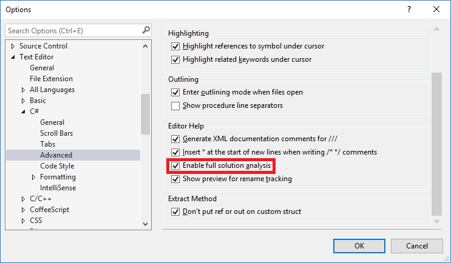
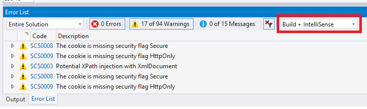
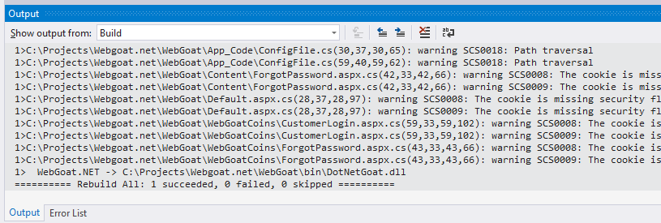
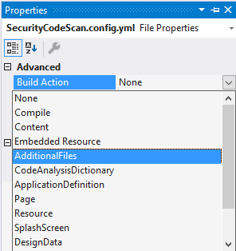
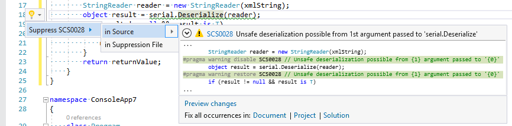
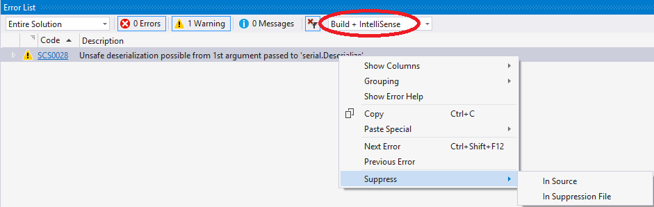
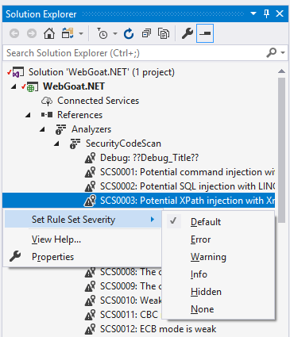

# Configuration
## Background analysis scope
*Background analysis scope* is a Visual Studio feature that enables you to choose whether you see code analysis issues only in open Visual C# or Visual Basic files in your solution, or in both open and closed Visual C# or Visual Basic files in your solution. For performance reasons it is disabled by default. It is not needed if SCS is installed as NuGet package, because it will run during a build, but if it is enabled you'll see the warnings as IntelliSense from NuGet too. In VS extension case open Tools > Options in Visual Studio. Select Text Editor > C# (or Basic) > Advanced. Make sure the "Entire solution" is selected:

  
Since *Entire solution* for IntelliSense has performance impact this is another reason to use SCS during a build only as a NuGet instead of Visual Studio extension. Microsoft has some [additional information](https://docs.microsoft.com/en-us/visualstudio/code-quality/how-to-enable-and-disable-full-solution-analysis-for-managed-code) on the configuration option.

## Testing on WebGoat.NET
Download an intentionally vulnerable project [WebGoat.NET](https://github.com/OWASP/WebGoat.NET/zipball/master) for testing. Open the solution. If you have installed SCS as a VS extension you should see warning after few seconds in the "Errors" tab. Make sure IntelliSense results are not filtered in the window:



If SCS is installed as NuGet package and *Entire solution* is disabled you'll need to build the solution. Then you should see the warning in the "Errors" and "Output" tabs:



## Analyzing .aspx and web.config Files
To enable analysis of these files you need to modify all C#(.csproj) and VB.NET(.vbproj) projects in a solution and add "AdditionalFileItemNames" element as shown below:
```xml
<Project DefaultTargets="Build" ToolsVersion="4.0" xmlns="http://schemas.microsoft.com/developer/msbuild/2003">
  <PropertyGroup>
    [..]
    <TargetFrameworkProfile />
    <!-- Add the line below -->
    <AdditionalFileItemNames>$(AdditionalFileItemNames);Content</AdditionalFileItemNames>
  </PropertyGroup>
```
The helper PowerShell script can be used to do it automatically for all projects in a subfolder:
```powershell
  Get-ChildItem *.csproj -Recurse | ForEach-Object {
    $content = [xml] (Get-Content $_)
    $propertyGroups = $content.SelectNodes("//Project/PropertyGroup")

    if (-not $propertyGroups[0].AdditionalFileItemNames) {
      Write-Host "AdditionalFileItemNames missing in $_"
      $additionalFileItemNamesElt = $content.CreateElement("AdditionalFileItemNames")
      $additionalFileItemNamesElt.set_InnerText('$(AdditionalFileItemNames);Content')
      $propertyGroups[0].AppendChild($additionalFileItemNamesElt)
    }

    Set-ItemProperty $_ -name IsReadOnly -value $false
    $content.Save($_)
    # Normalize line endings
    (Get-Content $_ -Encoding UTF8) | Set-Content $_ -Encoding UTF8
  }
```

## External Configuration Files
There are two types of external configuration files that can be used together: per user account and per project. It allows you to customize settings from [built-in configuration](https://github.com/security-code-scan/security-code-scan/blob/vs2019/SecurityCodeScan/Config/Main.yml) or add new rules. Global settings file location is `%LocalAppData%\SecurityCodeScan\config-3.1.yml` on Windows and `$XDG_DATA_HOME/.local/share` on Unix.  

For project specific settings add a file named SecurityCodeScan.config.yml into a project.
> ⚠️Note:
> The file doesn't have a version number in the name. Instead it **must** have `Version: 3.1` configuration setting in it's content. If the setting is missing you will get a runtime analysis exception.

Go to file properties and set the Build Action to AdditionalFiles:



### Custom taint source, sinks, sanitizers and validators

An example of user's (per OS user) config-3.1.yml with custom sink function (method that shouldn't be called with untrusted data without first being sanitized):

```yaml
Sinks:
  - Type: System.Messaging.BinaryMessageFormatter
    TaintTypes:
      - SCS0028
    Methods:
    - Name: Read
      Arguments:
        - message
```

An example of the same rule in SecurityCodeScan.config.yml (per project):

```yaml
Version: 3.1

Sinks:
  - Type: System.Messaging.BinaryMessageFormatter
    TaintTypes:
      - SCS0028
    Methods:
    - Name: Read
      Arguments:
        - message
```

See the [configuration file](https://github.com/security-code-scan/security-code-scan/blob/vs2019/SecurityCodeScan/Config/Main.yml) for comments and examples of usage.  

### Audit Mode
Audit mode is off by default. It can be turned on in an external configuration file to get more potentially false positive warnings about data with unknown taint state.

## Suppressing and Fixing the Warnings
If *Code Fixer* is not implemented for the warning the link "Show potential fixes" won't work. For many warnings there are too many options to resolve the issue, so the code has to be modified manually.
If the warning is false positive it can be suppressed that is [standard functionality for Visual Studio](https://docs.microsoft.com/en-us/visualstudio/code-quality/in-source-suppression-overview) however the UI not very intuitive, because you have to click on the underlined piece of code, only then a bubble appears at the beginning of the line where suppress menu is available:



Another place where the menu is available is *Error List*:



It is possible to filter shown item in *Error List* by different criteria: warning id, project name, etc.
You can permanently suppress entire warning type for a project by setting it's warning id severity to *None*. Microsoft has [it's own documentation](https://docs.microsoft.com/en-us/visualstudio/code-quality/use-roslyn-analyzers) about suppressions, rule sets and severities.

## Severity
Each warning severity is configurable: expand References > Analyzers > SecurityCodeScan under the project in a Solution window, right click on a warning ID and modify the severity. WebGoat.NET.ruleset will be automatically saved in the project's directory:



## Troubleshooting
If no SCS warnings are displayed, temporarily disable other installed analyzers. A buggy analyzer may [affect results from other analyzers](https://github.com/dotnet/roslyn/issues/23879).
