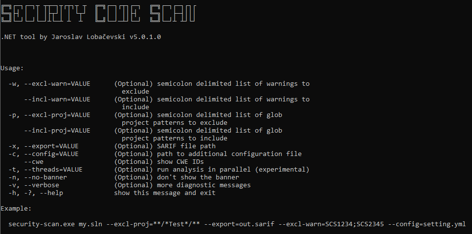

# Installation
> ⚠️**Warning**: Security Code Scan (SCS) is not a Linter. It is a real static analysis tool that does extensive computations. Thus installing it as a Visual Studio extension or NuGet package will slow down your Visual Studio IDE. The VS extension installation is intented for security engineers and researchers who need to scan different software products and having SCS always running is convenient for the use case. The more common use case of SCS would be running it in CI/CD pipeline. For this purpose there are [GitHub](https://github.com/marketplace/actions/securitycodescan) and [GitLab](https://docs.gitlab.com/ee/user/application_security/sast/analyzers.html) integrations. For custom integrations there is a [Stand-alone runner](https://www.nuget.org/packages/security-scan/).

SCS [can be installed as](https://docs.microsoft.com/en-us/visualstudio/code-quality/install-roslyn-analyzers):
* [Visual Studio extension](https://marketplace.visualstudio.com/items?itemName=JaroslavLobacevski.SecurityCodeScanVS2019). Use the link or open "Tools > Extensions and Updates..." Select "Online" in the tree on the left and search for SecurityCodeScan in the right upper field. Click "Download" and install.
* [NuGet package](https://www.nuget.org/packages/SecurityCodeScan.VS2019/).
  * Right-click on the root item in your solution. Select "Manage NuGet Packages for Solution...". Select "Browse" on the top and search for SecurityCodeScan.VS2019. Select project you want to install into and click "Install".
  * Another option is to install the package into all projects in a solution: use "Tools > NuGet Package Manager > Package Manager Console". Run the command `Get-Project -All | Install-Package SecurityCodeScan.VS2019`.
* [Stand-alone runner](https://www.nuget.org/packages/security-scan/). Install with `dotnet tool install --global security-scan` and run `security-scan /your/solution.sln`. For older .NET 4.x please use `security-scan4x.zip` from [GitHub Releases](https://github.com/security-code-scan/security-code-scan/releases).

Installing it as NuGet package allows to choose projects in a solution that should be analyzed. It is a good idea to exclude test projects, because they do not make it into a final product.  
> ⚠️Note:
> In previous versions of .NET Core, if you added a reference to a project that had a Roslyn analyzer as NuGet package, it was automatically added to the dependent project too. To disable this behavior, for example if the dependent project is a unit test project, make sure the NuGet package is added as private in the *.csproj* or *.vbproj* file of the referenced project:
>
> ```xml
> <PackageReference Include="SecurityCodeScan.VS2019" Version="5.0.0" PrivateAssets="all" />
> ```

> ⚠️ If during the analysis you run into `warning CS8032: An instance of analyzer SecurityCodeScan.Analyzers.****** cannot be created from... Could not load file or assembly 'Microsoft.CodeAnalysis, Version=******'. The system cannot find the file specified..` most likely there is a [mismatch between the used compiler toolset/SDK and the version of Roslyn analyzer library used by SCS](https://github.com/dotnet/roslyn/issues/2683). You may work-around the issue by:  
> a. Adding the latest `Microsoft.Net.Compilers.Toolset` NuGet package to the project: `dotnet add package microsoft.net.compilers.toolset`. Please note as per Microsoft "*This package is primarily intended as a method for rapidly shipping hotfixes to customers. Using it as a long term solution for providing newer compilers on older MSBuild installations is explicitly not supported. That can and will break on a regular basis. The supported mechanism for providing new compilers in a build enviroment is updating to the newer .NET SDK or Visual Studio Build Tools SKU.*"  
> b. Upgrading the project to the newer .NET SDK/Compiler version.  
> c. Using an older version of SCS.  

The NuGet version runs during a build and in background as IntelliSense (VS extension provides IntelliSense only) and can be integrated to any Continuous Integration (CI) server that supports [MSBuild](https://msdn.microsoft.com/en-us/library/dd393574.aspx).

When SCS is installed as Visual Studio extension or added to a project as NuGet package it does static analysis in background as you type or read the code. Running SCS as stand-alone tool gives more control when the analysis starts and finishes. The stand-alone tool allows customizing different parameters and, for example, exclude unit test projects:



## Integration with Continuous Integration (CI) builds and third-party tools
CI support for [GitHub](https://github.com/marketplace/actions/securitycodescan) and [GitLab](https://docs.gitlab.com/ee/user/application_security/sast/analyzers.html) pipelines. [Stand-alone runner](https://www.nuget.org/packages/security-scan/) or through [MSBuild](https://msdn.microsoft.com/en-us/library/dd393574.aspx) for custom integrations.
For custom integrations SCS is capable of producing results in SARIF format and displaying warnings with other build messages in the build output. SCS warnings are in the form of  
`[source file](line,column): warning SCS[rule id]: [warning description] [project_file]`

A [script](https://github.com/SPoint42/SecurityTools/tree/main/SCDotNet2DefectDojo) is available for importing the analysis results into [DefectDojo](https://github.com/DefectDojo/django-DefectDojo).  
